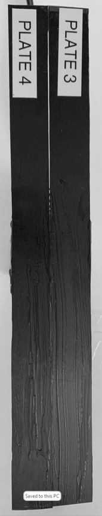

```sh
(ChatGPT) Python_Cpp_Interop_2 > ./compare_files
---------------------------------------------------
The file code.proposed/CMakeLists.txt has the following corrections:
21c21
< add_library(imageprocessing MODULE imageprocessing.cpp)
---
> add_library(imageprocessing MODULE imageprocessing.cpp ImageReader.cpp ImageProcessor.cpp ImageWriter.cpp) # ChatGPT forgot to add all source codes.
22a23,24
>
> set_target_properties(imageprocessing PROPERTIES PREFIX "")    # Just to remove the prefix 'lib'
---------------------------------------------------
The file code.proposed/ImageDataHolder.h was fine.
---------------------------------------------------
The file code.proposed/ImageProcessor.cpp was fine.
---------------------------------------------------
The file code.proposed/ImageProcessor.h was fine.
---------------------------------------------------
The file code.proposed/ImageReader.cpp was fine.
---------------------------------------------------
The file code.proposed/ImageReader.h was fine.
---------------------------------------------------
The file code.proposed/ImageWriter.cpp was fine.
---------------------------------------------------
The file code.proposed/ImageWriter.h was fine.
---------------------------------------------------
The file code.proposed/imageprocessing.cpp was fine.
---------------------------------------------------
The file code.proposed/processing_script.py was fine.
(ChatGPT) Python_Cpp_Interop_2 > cd code.debugged
(ChatGPT) code.debugged > cmake -Bbuild
-- The C compiler identification is GNU 9.4.0
-- The CXX compiler identification is GNU 9.4.0
-- Check for working C compiler: /usr/bin/cc
-- Check for working C compiler: /usr/bin/cc -- works
-- Detecting C compiler ABI info
-- Detecting C compiler ABI info - done
-- Detecting C compile features
-- Detecting C compile features - done
-- Check for working CXX compiler: /usr/bin/c++
-- Check for working CXX compiler: /usr/bin/c++ -- works
-- Detecting CXX compiler ABI info
-- Detecting CXX compiler ABI info - done
-- Detecting CXX compile features
-- Detecting CXX compile features - done
-- Found OpenCV: /usr/local (found version "4.7.0")
-- pybind11 v2.7.1
-- Found PythonInterp: /home/saidz/ChatGPT/bin/python (found version "3.8.10")
-- Found PythonLibs: /usr/lib/x86_64-linux-gnu/libpython3.8.so
-- Performing Test HAS_FLTO
-- Performing Test HAS_FLTO - Success
-- Configuring done
-- Generating done
-- Build files have been written to: /home/saidz/ChatGPT-Coding-Experiments/Python_Cpp_Interop_No_Var_Exchange/code.debugged/build
(ChatGPT) code.debugged > cmake --build build/.
Scanning dependencies of target imageprocessing
[ 20%] Building CXX object CMakeFiles/imageprocessing.dir/imageprocessing.cpp.o
[ 40%] Building CXX object CMakeFiles/imageprocessing.dir/ImageReader.cpp.o
[ 60%] Building CXX object CMakeFiles/imageprocessing.dir/ImageProcessor.cpp.o
[ 80%] Building CXX object CMakeFiles/imageprocessing.dir/ImageWriter.cpp.o
[100%] Linking CXX shared module imageprocessing.so
[100%] Built target imageprocessing
(ChatGPT) code.debugged > ls build/
CMakeCache.txt  CMakeFiles  Makefile  _deps  cmake_install.cmake  imageprocessing.so
(ChatGPT) code.debugged > mv build/imageprocessing.so .
(ChatGPT) code.debugged > python processing_script.py
Enter the name of the image to read: ../Picture1.png
Processing image...
Enter the name of the output image: Picture2.png
Done.
(ChatGPT) code.debugged > ls -l Picture2.png
-rw-r--r-- 1 saidz saidz 83193 May 18 22:38 Picture2.png
(ChatGPT) code.debugged > ls -l ../Picture1.png
-rwxr-xr-x 1 saidz saidz 863080 May 13 13:07 ../Picture1.png
```
" />

" />

" />
