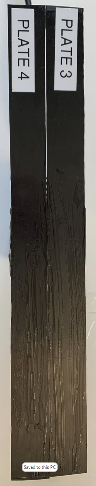
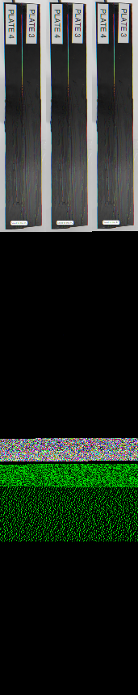

```sh
(ChatGPT) Python_Cpp_Interop_Variable_Exchange > cd code.proposed/
(ChatGPT) code.proposed > ls
CMakeLists.txt  ImageProcessor.h  ImageReader.h  ImageWriter.h  imageproc.cpp  libimageproc.so  myscript.py
(ChatGPT) code.proposed > cmake -Bbuild .
-- The C compiler identification is GNU 9.4.0
-- The CXX compiler identification is GNU 9.4.0
-- Check for working C compiler: /usr/bin/cc
-- Check for working C compiler: /usr/bin/cc -- works
-- Detecting C compiler ABI info
-- Detecting C compiler ABI info - done
-- Detecting C compile features
-- Detecting C compile features - done
-- Check for working CXX compiler: /usr/bin/c++
-- Check for working CXX compiler: /usr/bin/c++ -- works
-- Detecting CXX compiler ABI info
-- Detecting CXX compiler ABI info - done
-- Detecting CXX compile features
-- Detecting CXX compile features - done
-- Found OpenCV: /usr/local (found version "4.7.0")
-- Found PythonInterp: /home/saidz/ChatGPT/bin/python (found version "3.8.10")
-- Found PythonLibs: /usr/lib/x86_64-linux-gnu/libpython3.8.so
-- Configuring done
-- Generating done
-- Build files have been written to: /home/saidz/ChatGPT-Coding-Experiments/Python_Cpp_Interop_Variable_Exchange/code.proposed/build
(ChatGPT) code.proposed > cmake --build build/.
Scanning dependencies of target imageproc
[ 50%] Building CXX object CMakeFiles/imageproc.dir/imageproc.cpp.o
[100%] Linking CXX shared module libimageproc.so
[100%] Built target imageproc
(ChatGPT) code.proposed > ls build/
CMakeCache.txt  CMakeFiles  Makefile  cmake_install.cmake  libimageproc.so
(ChatGPT) code.proposed > mv libimageproc.so .
mv: 'libimageproc.so' and './libimageproc.so' are the same file
(ChatGPT) code.proposed > mv build/libimageproc.so .
(ChatGPT) code.proposed > python myscript.py
Enter the input filename: ../Picture1.png
Enter the output filename: Picture2.png
(ChatGPT) code.proposed > ls -l Picture2.png
-rw-r--r-- 1 saidz saidz 129412 May 18 22:47 Picture2.png
(ChatGPT) code.proposed > python -m nuitka myscript.py
Nuitka-Options:INFO: Used command line options: myscript.py
Nuitka-Options:WARNING: You did not specify to follow or include anything but main program. Check options
Nuitka-Options:WARNING: and make sure that is intended.
Nuitka:INFO: Starting Python compilation with Nuitka '1.5.7' on Python '3.8' commercial grade 'not installed'.
Nuitka:INFO: Completed Python level compilation and optimization.
Nuitka:INFO: Generating source code for C backend compiler.
Nuitka:INFO: Running data composer tool for optimal constant value handling.
Nuitka:INFO: Running C compilation via Scons.
Nuitka-Scons:INFO: Backend C compiler: gcc (gcc).
Nuitka-Scons:INFO: Backend linking program with 6 files (no progress information available).
Nuitka-Scons:WARNING: You are not using ccache.
Nuitka:INFO: Keeping build directory 'myscript.build'.
Nuitka:INFO: Successfully created 'myscript.bin'.
(ChatGPT) code.proposed > ls -l
total 6484
-rw-r--r-- 1 saidz saidz     265 May 18 21:44 CMakeLists.txt
-rw-r--r-- 1 saidz saidz     270 May 18 21:59 ImageProcessor.h
-rw-r--r-- 1 saidz saidz     305 May 18 21:59 ImageReader.h
-rw-r--r-- 1 saidz saidz     189 May 13 11:46 ImageWriter.h
-rw-r--r-- 1 saidz saidz  129412 May 18 22:47 Picture2.png
drwxr-xr-x 3 saidz saidz    4096 May 18 22:46 build
-rw-r--r-- 1 saidz saidz    2521 May 18 22:07 imageproc.cpp
-rwxr-xr-x 1 saidz saidz  872264 May 18 22:46 libimageproc.so
-rwxr-xr-x 1 saidz saidz 5602040 May 18 22:53 myscript.bin
drwxr-xr-x 3 saidz saidz    4096 May 18 22:53 myscript.build
-rw-r--r-- 1 saidz saidz     474 May 13 12:50 myscript.py
(ChatGPT) code.proposed >
(ChatGPT) code.proposed > ./myscript.bin
Enter the input filename: ../Picture1.png
Enter the output filename: PictureNuitka.png
(ChatGPT) code.proposed > ls -l
total 6612
-rw-r--r-- 1 saidz saidz     265 May 18 21:44 CMakeLists.txt
-rw-r--r-- 1 saidz saidz     270 May 18 21:59 ImageProcessor.h
-rw-r--r-- 1 saidz saidz     305 May 18 21:59 ImageReader.h
-rw-r--r-- 1 saidz saidz     189 May 13 11:46 ImageWriter.h
-rw-r--r-- 1 saidz saidz  129412 May 18 22:47 Picture2.png
-rw-r--r-- 1 saidz saidz  129414 May 18 22:54 PictureNuitka.png
drwxr-xr-x 3 saidz saidz    4096 May 18 22:46 build
-rw-r--r-- 1 saidz saidz    2521 May 18 22:07 imageproc.cpp
-rwxr-xr-x 1 saidz saidz  872264 May 18 22:46 libimageproc.so
-rwxr-xr-x 1 saidz saidz 5602040 May 18 22:53 myscript.bin
drwxr-xr-x 3 saidz saidz    4096 May 18 22:53 myscript.build
-rw-r--r-- 1 saidz saidz     474 May 13 12:50 myscript.py
(ChatGPT) code.proposed >
```

" />

" />

" />
